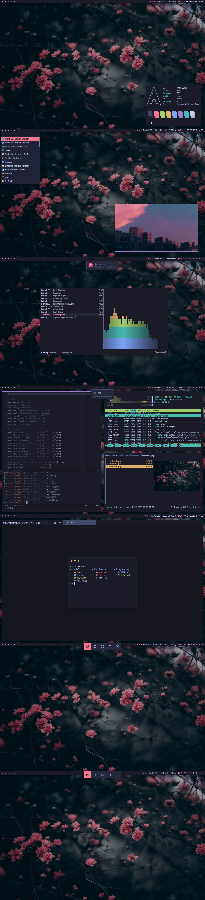

# Dotfiles
_My personal dotfiles for bspwm, neovim, ranger, ncmpcpp, firefox, rofi and more!_

## Screenshots

## Details

- WM: [bspwm](https://github.com/baskerville/bspwm)
- Wallpaper: [here](.local/share/backgrounds/20220301.jpg)
- Colorscheme: [Tokyo Night](https://github.com/folke/tokyonight.nvim)
- Bar: [Polybar](https://github.com/polybar/polybar)
- Launcher: [rofi](https://github.com/davatorium/rofi)
- Compositor: [Picom (ibhagwan)](https://github.com/ibhagwan/picom)
- Terminal: [st](https://github.com/lr-tech/st)
  - Font: [Iosevka Nerd Font Mono](https://www.nerdfonts.com/)
  - Shell: [fish](https://github.com/fish-shell/fish-shell)
  - Editor: [neovim](https://neovim.io/)
  - File Manager: [ranger](https://github.com/ranger/ranger)
  - Music Player: [ncmpcpp](https://rybczak.net/ncmpcpp/)
  - Task Manager: [htop-vim](https://github.com/KoffeinFlummi/htop-vim)
  - Fetch: [neofetch](https://github.com/dylanaraps/neofetch)
  - AUR Helper: [yay](https://github.com/Jguer/yay)
- Web Browser: Firefox
  - userChrome: [Cascade](https://github.com/andreasgrafen/cascade/)
- File Manager: [pcmanfm-gtk3](https://wiki.lxde.org/en/PCManFM)
- Image Viewer: [feh](https://feh.finalrewind.org/)
- Media Player: [mpv](https://mpv.io/)
- Document Viewer: [Zathura](https://pwmt.org/projects/zathura/)([mupdf](https://pwmt.org/projects/zathura-pdf-mupdf/))
- Icons: [WhiteSur](https://github.com/vinceliuice/WhiteSur-icon-theme)
- Fonts: [Inter](https://github.com/rsms/inter)/[Iosevka Nerd Font Mono](https://www.nerdfonts.com/) 
- GTK Theme: [Dracula](https://github.com/dracula/gtk)
- Notifications: [dunst](https://dunst-project.org/)
- Screenshooter: [maim](https://github.com/naelstrof/maim)
- Clipboard Manager: [xclip](https://github.com/astrand/xclip)
- Settings Manager: [LXAppearance](https://wiki.lxde.org/en/LXAppearance)/qt5ct
