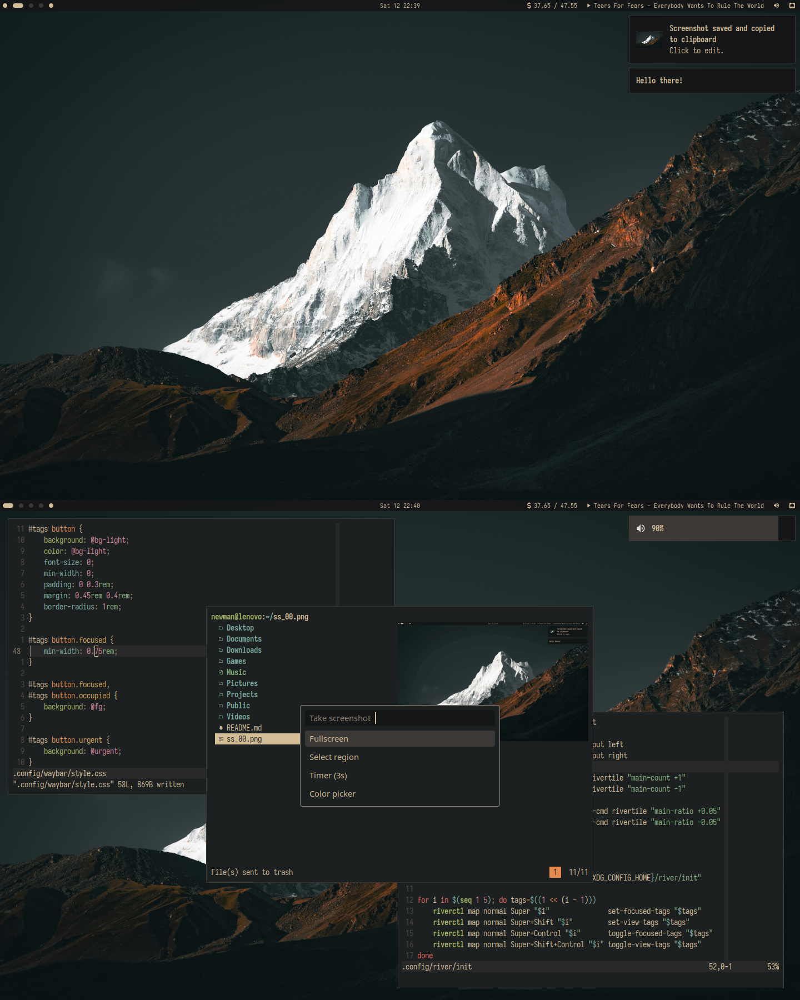

# Dotfiles

## Details

- Distro: [Arch Linux](https://archlinux.org/)
- Wallpaper: [here](.config/bg)
- Colorscheme: [onedark](https://github.com/navarasu/onedark.nvim)
- Font: [Iosevka Nerd Font](https://www.nerdfonts.com/)/[Inter](https://github.com/rsms/inter)
- WM: [dwm](https://github.com/newmanls/dwm)
  - Status: [dwmsb.py](.local/bin/dwmsb.py)
- Terminal: [st](https://github.com/newmanls/st)
  - Shell: [bash](https://www.gnu.org/software/bash/bash.html)
  - Editor: [neovim](https://neovim.io/)
  - File Manager: [lf](https://github.com/gokcehan/lf)
  - Music Player: [cmus](https://cmus.github.io/)
    - Notifications: [notify-cmus](.local/bin/notify-cmus)
  - Feed reader: [newsboat](https://newsboat.org/)
  - List command: [exa](https://the.exa.website/)
- Launcher: [dmenu](https://github.com/newmanls/dmenu)
- Web Browser: [firefox](https://www.mozilla.org/firefox/)
- Image Viewer: [nsxiv](https://github.com/nsxiv/nsxiv)
- Media Player: [mpv](https://mpv.io/)
- Document Viewer: [zathura](https://pwmt.org/projects/zathura/)([mupdf](https://pwmt.org/projects/zathura-pdf-mupdf/))
- Notification daemon: [dunst](https://dunst-project.org/)
- Screenshooter: [imagemagick](https://www.imagemagick.org/)
- Settings Manager: [lxappearance-gtk3](https://wiki.lxde.org/en/LXAppearance)/[qt5ct](https://qt5ct.sourceforge.io/)
