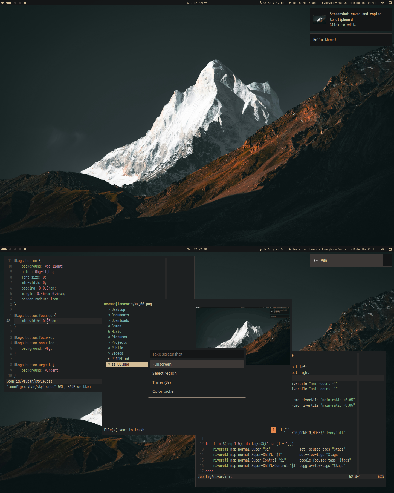

# Details

Category        | Value
--------------- | ---
Distro          | [CachyOS](https://cachyos.org/)
Wallpaper       | [here](.local/share/backgrounds), set using [awww](https://codeberg.org/LGFae/awww)
Colorscheme     | Dynamically generated with [matugen](https://github.com/InioX/matugen)
Compositor      | [niri](https://github.com/YaLTeR/niri)
Status bar      | [waybar](https://github.com/Alexays/Waybar/)
Notifications   | [mako](https://github.com/emersion/mako)
Launcher        | [rofi](https://davatorium.github.io/rofi)
Terminal        | [foot](https://codeberg.org/dnkl/foot)
Terminal font   | [Iosevka Nerd Font Mono](https://www.nerdfonts.com/)
Shell           | [zsh](https://www.zsh.org/) with [starship](https://starship.rs/)
Text editor     | [neovim](https://neovim.io/)
File manager    | [lf](https://github.com/gokcehan/lf)
Web Browser     | [firefox](https://www.mozilla.org/firefox/)
Image Viewer    | [viewnior](https://siyanpanayotov.com/project/viewnior)
Media Player    | [mpv](https://mpv.io/)
Document Viewer | [zathura](https://pwmt.org/projects/zathura/)[^1]

[^1]: with [mupdf backend](https://pwmt.org/projects/zathura-pdf-mupdf/)

# Installation

```sh
git clone --bare https://github.com/newmanls/dotfiles "${HOME}/.dotfiles"
alias dots='/usr/bin/git --git-dir="${HOME}/.dotfiles" --work-tree="$HOME"'
dots config --local status.showUntrackedFiles no
dots checkout
```
